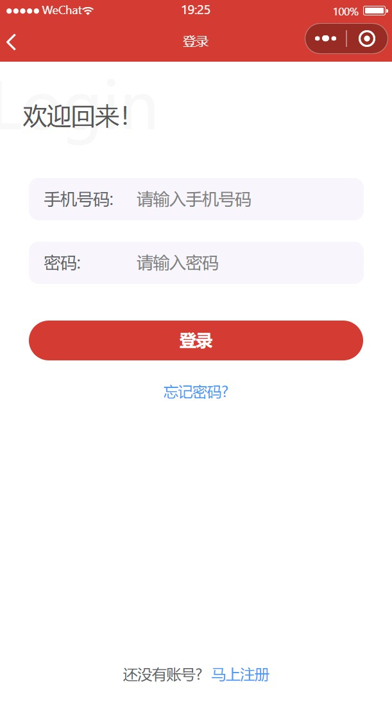
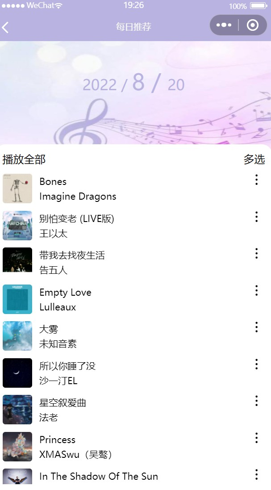
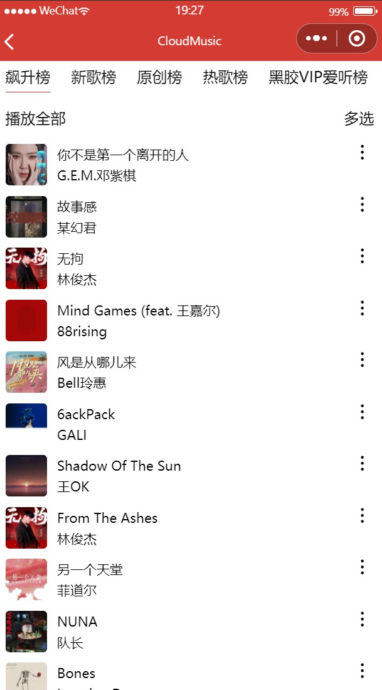
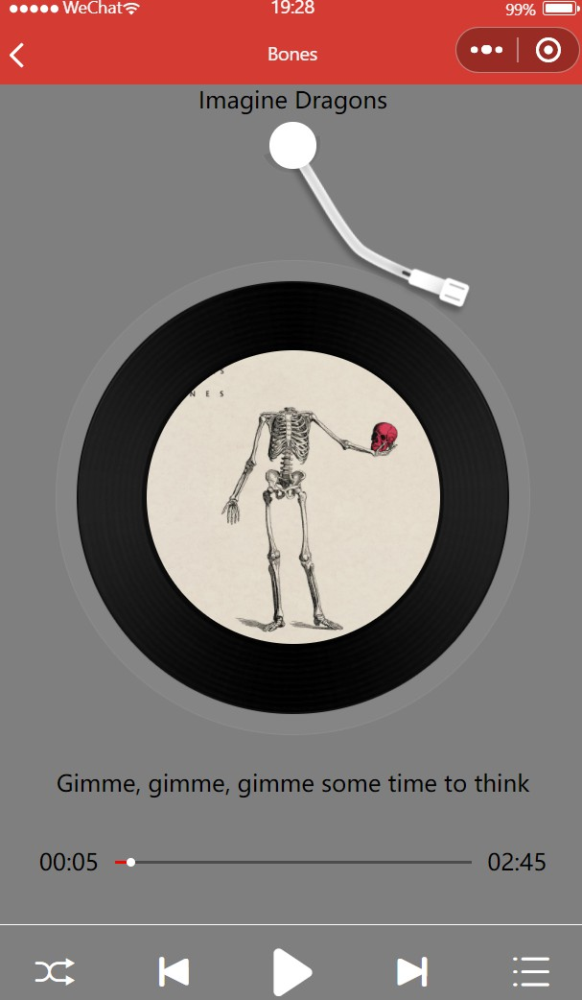

# CloudMusic

> `CloudMusic` 是一个仿 `网易云音乐` 的小程序应用，后台接口使用了 [Binaryify/NeteaseCloudMusicApi: 网易云音乐 Node.js API service (github.com)](https://github.com/Binaryify/NeteaseCloudMusicApi) 提供的 `node.js` 服务

**NeteaseCloudMusicApi** 为服务端

**CloudMusic** 为用户端

## 功能

- banner显示
- 每日推荐
- 推荐歌单
- 排行榜
- 视频播放
- 登录
- 个人中心
- 歌曲播放
- 歌词显示
- ······

## 界面展示

### 首页

### 视频中心

### 登录界面

### 个人中心

### 每日推荐

### 歌单详情

### 排行榜

### 音乐详情

